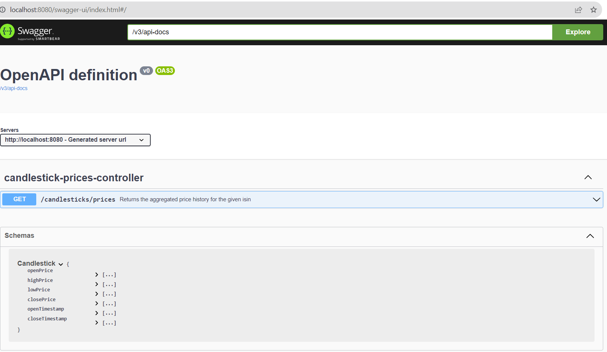
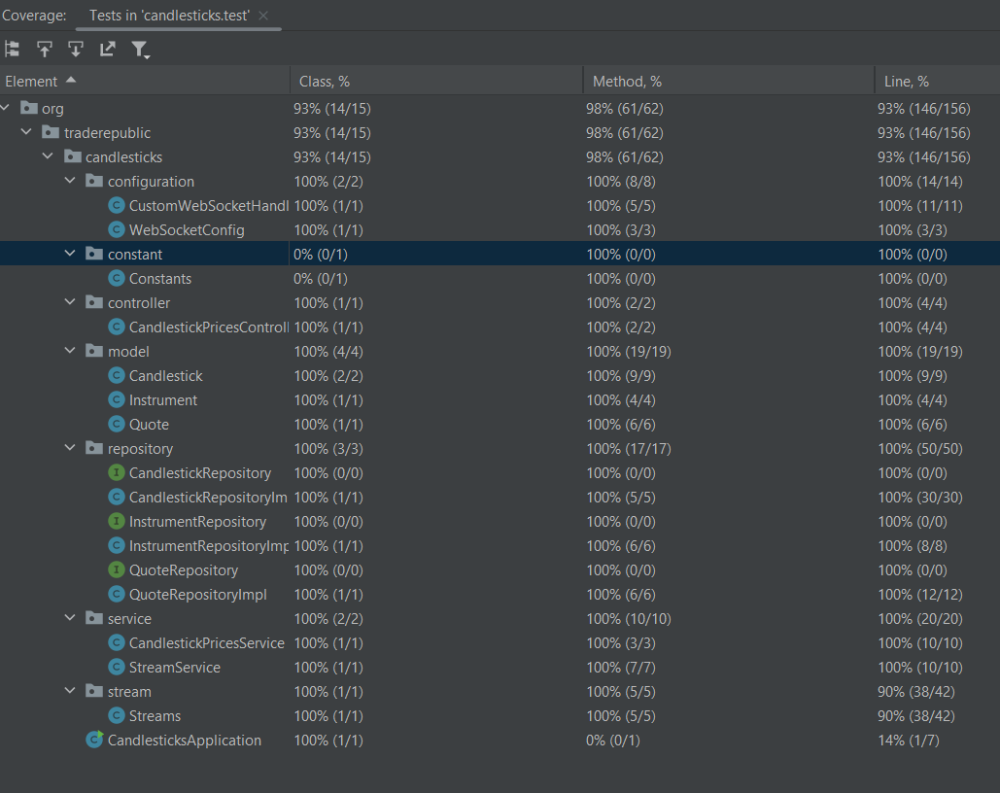

### Candlestick Application

This application runs on port 8080 by default. You can change the port by passing the `--server.port` argument to the application.

The application exposes one endpoint: 
`/prices/candlesticks?isin={ISIN}`. It returns a list of candlesticks for the given ISIN for last 30 minutes.

The application also exposes a websocket endpoint: and can be found on 8032 port after you start the partner service. 
for example: `ws://localhost:8032/instruments` and `ws://localhost:8032/quotes`
or website preview of how the stream look (http://localhost:8032).

### Architecture
The application is built on top of Spring Boot and uses Java 17, Lombok, SpringDoc-OpenApi, SpringBoot-Websocket.

### Storage
The application uses in-memory key, value structure based on time storage for storing the data. 
This provides extremely fast way to store and retrieve data.

### Running the app

you should start the partner service, otherwise you'll get error and application will not work correctly.
For starting partner service, please run the following commands within the application root directory:
`java -jar partner-service-1.0.0.jar --server.port=8032`

To run a partner service you can either use docker-compose. Docker v3 or above will require slight changes to the docker-compose files.
``` 
docker-compose up -d
```

Once partner service is running, to run the app you can use the following gradle commands.
```./gradlew bootRun```

Once the server is running you can check the results at via postman or any other rest client at
```localhost:8080/prices/candlesticks?isin={ISIN}```

you can use the following curl command:
```curl --location --request GET 'localhost:8080/prices/candlesticks?isin={ISIN}'```

or you can see on swagger openapi page at:
```http://localhost:8080/swagger-ui.html```




For example after you hit the endpoint response will be look like the following for the ISIN you provided:
```[
{
"openPrice": 1257.3559,
"highPrice": 1257.3559,
"lowPrice": 1250.7288,
"closePrice": 1252.1017,
"openTimestamp": "2023-08-25T13:35:57.023089100Z",
"closeTimestamp": "2023-08-25T13:35:57.033969Z"
}
]
```

### Running the tests
To run the tests you can use the following gradle commands.
```./gradlew test```

Test Coverage


